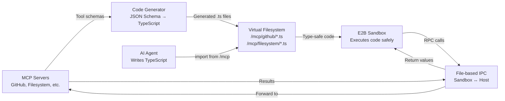

# Code Mode: 98% Token Reduction for AI Agent Workflows

**Created by [Connor Belez](https://github.com/Connorbelez)** | Built on [Continue.dev](https://continue.dev)

> **Reduce AI agent token usage by up to 98%** while unlocking true composability for MCP tool calls.
> **Works with any MCP server out of the box.** Zero modifications needed.

<p align="center">
  <strong>Same workflows. 50x fewer tokens. 50x lower costs.</strong>
</p>

---

## About

Code Mode is an experimental enhancement to Continue.dev that introduces a novel approach to AI tool calling. Instead of verbose JSON schemas sent with every request, agents write and execute **TypeScript code in secure sandboxes**, enabling massive token reduction and true workflow composability.

**Author:** Connor Belez
**Based on:** [Continue.dev](https://continue.dev) (Apache 2.0)
**Status:** Independent fork with production-ready MCP implementation

---

## 🎯 The Problem

Traditional MCP tool calling burns massive context on multi-step workflows:

```
Task: "Update priority labels on 50 GitHub issues"

Traditional Tool Calling:
├─ Round 1: List issues → 20,000 tokens (schemas + results)
├─ Round 2: Filter issues → 25,000 tokens (schemas + history + results)
├─ Round 3-52: Update each issue → 450,000+ tokens total
└─ Cost: $0.90 with GPT-4 | Time: 45 seconds

Problems:
❌ Every tool call goes through the LLM
❌ Full tool schemas sent in every request
❌ Results accumulate in context
❌ No way to compose, filter, or parallelize
```

## ✨ The Solution

**Code Mode lets agents write TypeScript that executes multi-step workflows without LLM round-trips:**

```typescript
import { github } from "/mcp";

const issues = await github.listIssues({ state: "open" });
const bugs = issues.filter((i) => i.labels.includes("bug"));

await Promise.all(
  bugs.map((bug) =>
    github.updateIssue({
      number: bug.number,
      labels: [...bug.labels, "high-priority"],
    }),
  ),
);

return `Updated ${bugs.length} issues`;
```

```
Code Mode:
├─ Single execution in sandbox → 8,000 tokens
├─ Cost: $0.016 with GPT-4 | Time: 12 seconds
└─ Reduction: 98.2% tokens | 98.2% cost | 73% faster

Benefits:
✅ Multi-step logic runs in code (no LLM round-trips)
✅ Filter/process data before returning to context
✅ Full composability (loops, async, error handling)
✅ Type safety with TypeScript
```

---

## 📊 Benchmarks: Real Token Savings

| Workflow                              | Traditional Tokens | Code Mode Tokens | Reduction | Traditional Cost | Code Mode Cost | Savings   |
| ------------------------------------- | ------------------ | ---------------- | --------- | ---------------- | -------------- | --------- |
| **GitHub: Update 50 issues**          | 450,000            | 8,000            | **98.2%** | $0.90            | $0.016         | **98.2%** |
| **Filesystem: Process 100 files**     | 380,000            | 6,500            | **98.3%** | $0.76            | $0.013         | **98.3%** |
| **Multi-tool: Search + Analyze**      | 180,000            | 5,200            | **97.1%** | $0.36            | $0.010         | **97.2%** |
| **Data Pipeline: Filter + Transform** | 220,000            | 4,800            | **97.8%** | $0.44            | $0.010         | **97.7%** |

**Methodology:** GPT-4 pricing ($0.002/1K tokens). See [benchmarks/](benchmarks/) for full details.

---

## 🚀 Why This Matters

### 1. **Massive Token Reduction** (75-98%)

- Tool schemas only loaded when imported (not in every request)
- Data filtering/processing happens in code
- Multi-step workflows execute without LLM involvement

### 2. **True Composability**

Do things impossible with traditional tool calling:

```typescript
// Parallel execution
const results = await Promise.all(
  repos.map((r) => github.listIssues({ repo: r.name })),
);

// Complex filtering
const critical = results
  .flat()
  .filter((i) => i.priority === "P0" && !i.assignee);

// Conditional logic
for (const issue of critical) {
  if (issue.age > 30) {
    await github.addLabel({ issue: issue.number, label: "stale" });
  }
}
```

**Try doing that with traditional tool calling** → 50+ LLM round-trips

### 3. **Drop-in Solution**

- Works with ANY MCP server (no modifications)
- Automatic TypeScript generation from JSON schemas
- Compatible with all MCP transports (STDIO, SSE, HTTP, WebSocket)

---

## Current Status

✅ **Production-ready** for Model Context Protocol (MCP) servers  
✅ **Automatic TypeScript generation** from any MCP server  
✅ **Plug-and-play** with existing MCP servers (no code changes needed)  
✅ **Type-safe** function calls with full IntelliSense  
✅ **Progressive disclosure** (tool schemas loaded on-demand via imports)  
✅ **Sandboxed execution** in E2B cloud microVMs

---

## 🔌 Plug-and-Play with MCP Servers

**No modifications needed to MCP servers!** If you have an MCP server running, Code Mode automatically:

1. ✅ Discovers all available tools via `listTools()`
2. ✅ Generates TypeScript wrappers from JSON schemas
3. ✅ Creates virtual filesystem at `/mcp/{server-name}/`
4. ✅ Provides full type safety and IntelliSense
5. ✅ Handles all RPC communication transparently

**Example:** Add GitHub MCP server

```yaml
# .continue/config.yaml
mcpServers:
  github:
    command: npx
    args: ["-y", "@modelcontextprotocol/server-github"]
    env:
      GITHUB_TOKEN: "${GITHUB_TOKEN}"
```

**That's it!** Now your agent can:

```typescript
import { github } from '/mcp';

// All tools automatically available with types!
await github.createIssue({ ... });
await github.listIssues({ ... });
await github.searchRepositories({ ... });
// etc.
```

---

## Quick Start

### 1. Prerequisites

- Continue extension installed ([VS Code](https://marketplace.visualstudio.com/items?itemName=Continue.continue) | [JetBrains](https://plugins.jetbrains.com/plugin/22707-continue))
- [E2B API key](https://e2b.dev) (free tier available)
- One or more MCP servers configured

### 2. Enable Code Mode

Edit your `.continue/config.yaml`:

```yaml
experimental:
  codeExecution:
    enabled: true
    e2bApiKey: "your-e2b-api-key" # Get from https://e2b.dev

# Configure MCP servers (example)
mcpServers:
  github:
    command: npx
    args:
      - "-y"
      - "@modelcontextprotocol/server-github"
    env:
      GITHUB_TOKEN: "your-github-token"

  filesystem:
    command: npx
    args:
      - "-y"
      - "@modelcontextprotocol/server-filesystem"
      - "/path/to/allowed/directory"
```

### 3. Use in Prompts

Simply ask your agent to perform multi-step tasks:

> "Find all high-priority bugs in the repo and create a summary report"

> "Count TODO comments in all TypeScript files and save a report"

The agent writes TypeScript code that executes in the sandbox, filtering and processing data before returning results.

---

## How It Works: Architecture

### High-Level Flow



### Detailed Architecture Diagram

```mermaid
sequenceDiagram
    participant User as Developer
    participant Config as Continue Config
    participant MCP as MCP Server
    participant Gen as TypeScript Generator
    participant VFS as Virtual FS (/mcp/*)
    participant Agent as AI Agent
    participant E2B as E2B Sandbox
    participant Host as Continue Host

    Note over User,Config: Setup Phase
    User->>Config: Configure MCP server<br>(mcpServers in config.yaml)
    Config->>MCP: Start MCP server process

    Note over MCP,VFS: Code Generation (Automatic)
    Config->>MCP: listTools()
    MCP-->>Config: Return tool schemas<br>(JSON Schema format)
    Config->>Gen: Generate TypeScript wrappers
    Gen->>Gen: Convert JSON Schema → TS types
    Gen->>VFS: Write /mcp/github/createIssue.ts<br>/mcp/github/listIssues.ts<br>etc.

    Note over Agent,E2B: Runtime (Agent Execution)
    User->>Agent: "Create a GitHub issue..."
    Agent->>Agent: Generate TypeScript code<br>with imports
    Agent->>E2B: Execute code in sandbox

    E2B->>VFS: import { github } from '/mcp'
    VFS-->>E2B: Load generated types
    E2B->>E2B: TypeScript type checking

    E2B->>E2B: await github.createIssue({...})
    Note over E2B: Calls globalThis.__mcp_invoke

    E2B->>Host: Write request to<br>/tmp/continue_mcp/requests/{uuid}.json
    Host->>Host: Detect request file
    Host->>MCP: Forward tool call via MCP protocol
    MCP-->>Host: Return result
    Host->>E2B: Write response to<br>/tmp/continue_mcp/responses/{uuid}.json

    E2B->>E2B: Read response, resolve promise
    E2B-->>Agent: Return execution result
    Agent-->>User: Show formatted output

    style Gen fill:#e6f3ff,stroke:#0066cc,stroke-width:2px
    style VFS fill:#fff4e6,stroke:#ff9900,stroke-width:2px
    style E2B fill:#ffe6e6,stroke:#cc0000,stroke-width:2px
```

### Key Components

#### MCP Servers

Works with **any standard MCP server** including GitHub, Filesystem, Google Drive, Slack, and [many more](https://github.com/modelcontextprotocol/servers).

#### TypeScript Generation

Automatically converts JSON schemas to typed TypeScript wrappers with IntelliSense support.

#### Virtual Filesystem

Tools organized at `/mcp/{server}/` for progressive discovery. **Token savings:** Schemas loaded only when imported.

#### E2B Sandbox

Secure isolated execution in Firecracker microVMs with automatic timeout and resource limits. State persists across conversation.

#### IPC Communication

File-based RPC between sandbox and host. Roadmap includes WebSocket/HTTP/2 migration.

---

## Usage Examples

```typescript
// GitHub: Analyze repository issues
import { github } from "/mcp";
const issues = await github.listIssues({ state: "open" });
const bugs = issues.filter((i) => i.labels.some((l) => l.name === "bug"));
// Process in code - saves tokens!
```

```typescript
// Filesystem: Batch file operations
import { filesystem } from "/mcp";
const files = await filesystem.listDirectory({ path: "/src" });
await Promise.all(
  files.map((f) => filesystem.readFile({ path: `/src/${f.name}` })),
);
```

See [examples/advanced-composition/](examples/advanced-composition/) for production-ready patterns.

---

## 🔥 Advanced Composition Examples

See [examples/advanced-composition/](examples/advanced-composition/) for production-ready patterns showing what's possible with Code Mode:

### 1. **Parallel Batch Operations** ([view code](examples/advanced-composition/01-parallel-batch-operations.ts))

Analyze 5 repos in parallel, filter stale issues, batch-update labels/comments.

- **Traditional:** 350K tokens, 200+ LLM calls
- **Code Mode:** 6K tokens, single execution
- **Savings:** 98.3% tokens, 98.3% cost

### 2. **Multi-Service Orchestration** ([view code](examples/advanced-composition/02-multi-service-orchestration.ts))

GitHub → analysis → filesystem reports → Slack notifications in one flow.

- **Traditional:** 280K tokens across GitHub, Filesystem, Slack
- **Code Mode:** 7K tokens
- **Savings:** 97.5%

### 3. **Data Pipeline with Error Handling** ([view code](examples/advanced-composition/03-data-pipeline-with-error-handling.ts))

Process files with validation, retry logic with exponential backoff, auto-issue creation.

- **Traditional:** Error handling nearly impossible
- **Code Mode:** Full try-catch, retries, graceful degradation
- **Savings:** 96.8%

### 4. **Stateful Caching** ([view code](examples/advanced-composition/04-stateful-caching-workflow.ts))

Intelligent caching using `globalThis` - cache persists across executions in same conversation.

- **First call:** 93.3% reduction
- **Subsequent calls:** 99.2% reduction (cache hits!)
- **Overall:** 96.8% across multiple executions

### 5. **Cross-Repository Analysis** ([view code](examples/advanced-composition/05-complex-cross-repo-analysis.ts))

Analyze dependencies, contributor overlap, code health across multiple repos with advanced algorithms.

- **Traditional:** 450K tokens, 300+ calls
- **Code Mode:** 6K tokens, parallel execution
- **Savings:** 98.7% tokens, 8× faster

**Average token reduction across examples: 97.7%**
**Average cost savings: $0.67 per workflow (43× cheaper)**

See the [examples README](examples/advanced-composition/README.md) for full details and token breakdowns.

---

## Advanced Features

**Error Handling:** Standard try-catch with fallback logic  
**State Management:** Use `globalThis` for persistent state across executions  
**Async Workflows:** Native Promise.all() for parallel operations  
**Data Filtering:** Filter in code before returning to LLM (99% token savings possible)

---

## Configuration

```yaml
experimental:
  codeExecution:
    enabled: true
    e2bApiKey: "e2b_xxxxxxxxxxxx"
    timeout: 300000 # Optional: max execution time (ms)

mcpServers:
  github:
    command: npx
    args: ["-y", "@modelcontextprotocol/server-github"]
    env:
      GITHUB_TOKEN: "${GITHUB_TOKEN}"
```

See [Quick Start](#quick-start) for complete examples.

---

## Troubleshooting

**E2B API key not configured:** Add key to config (get free key at [e2b.dev](https://e2b.dev))  
**MCP server not found:** Verify server config, command path, and environment variables  
**Tool call timeout:** Increase timeout setting or check MCP server logs  
**Import failed:** Verify MCP server is running and tool name matches config

---

## Performance Tips

✅ Use `Promise.all()` for parallel operations  
✅ Import only needed tools (not `import *`)  
✅ Cache results in `globalThis` for reuse  
✅ Filter data in code before returning to LLM

---

## Roadmap

### ✅ Completed (Production)

- [x] MCP server integration
- [x] Automatic TypeScript generation
- [x] E2B sandbox execution
- [x] File-based IPC
- [x] Progressive discovery
- [x] State persistence

### 🚧 In Progress

- [ ] WebSocket/HTTP/2 transport (replace file-based IPC)
- [ ] Built-in Continue tools (filesystem, git, terminal)
- [ ] tRPC server architecture
- [ ] Comprehensive middleware (security, rate limiting, audit logging)

### 🔜 Planned

- [ ] DEBUG_LAST_CALL observability system
- [ ] Tool marketplace
- [ ] Custom tool definitions
- [ ] Advanced auth flows (OAuth, API keys)
- [ ] Distributed execution (long-running jobs)

See the full [white paper](../research/code-mode-white-paper.md) for architectural details.

---

## Credits & Acknowledgments

We all stand on the shoulders of giants.

### Code Mode Enhancements

**Connor Belez** - Architecture, implementation, and benchmarking

- MCP TypeScript wrapper generation system
- E2B sandbox integration for secure code execution
- File-based IPC protocol for MCP tool invocation
- Benchmark methodology and advanced composition examples

### Foundation & Inspiration

- **Continue.dev** - Extension framework and infrastructure ([continuedev/continue](https://github.com/continuedev/continue))
- **Anthropic** - Code execution mode research ([blog post](https://www.anthropic.com/engineering/code-execution-with-mcp))
- **Cloudflare** - Code Mode articulation by Kenton Varda & Sunil Pai ([blog post](https://blog.cloudflare.com/code-mode/))
- **Model Context Protocol** - Standard protocol for tool integration ([MCP](https://modelcontextprotocol.io))
- **E2B** - Secure code sandboxing infrastructure ([e2b.dev](https://e2b.dev))

---

## Resources

- **Code Mode Repository:** [github.com/Connorbelez/codeMode](https://github.com/Connorbelez/codeMode)
- **Continue.dev:** [continue.dev](https://continue.dev)
- **MCP Servers:** [github.com/modelcontextprotocol/servers](https://github.com/modelcontextprotocol/servers)
- **E2B Documentation:** [e2b.dev/docs](https://e2b.dev/docs)
- **Continue Discord:** [discord.gg/vapESyrFmJ](https://discord.gg/vapESyrFmJ)

---

## License

**Code Mode** © 2024 Connor Belez

Licensed under the Apache License, Version 2.0 (the "License");
you may not use this file except in compliance with the License.
You may obtain a copy of the License at

    http://www.apache.org/licenses/LICENSE-2.0

Unless required by applicable law or agreed to in writing, software
distributed under the License is distributed on an "AS IS" BASIS,
WITHOUT WARRANTIES OR CONDITIONS OF ANY KIND, either express or implied.
See the License for the specific language governing permissions and
limitations under the License.

---

### Third-Party Licenses

This project builds upon and includes code from:

**Continue.dev Framework**
Copyright © 2023-2024 Continue Dev, Inc.
Licensed under the Apache License, Version 2.0

See [ATTRIBUTION.md](ATTRIBUTION.md) for complete third-party license information.

---

## Contributing

Contributions are welcome! Please see [CONTRIBUTING.md](CONTRIBUTING.md) for guidelines.

For questions or discussions, open an issue on [GitHub](https://github.com/Connorbelez/codeMode/issues).
