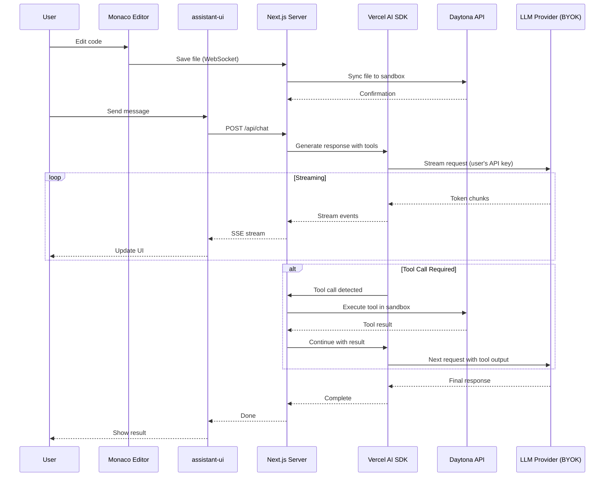

# Technical Design Document: AI-Powered Web Development Platform

**Project Name:** Code Mode Web Platform
**Version:** 1.0
**Date:** November 17, 2025
**Author:** Development Team

---

## Table of Contents

1. [Executive Summary](#executive-summary)
2. [System Architecture](#system-architecture)
3. [Technology Stack](#technology-stack)
4. [Component Design](#component-design)
5. [Data Flow & Communication](#data-flow--communication)
6. [Multi-Provider Architecture](#multi-provider-architecture)
7. [Daytona Integration](#daytona-integration)
8. [Security & Authentication](#security--authentication)
9. [Development Phases](#development-phases)
10. [Technical Specifications](#technical-specifications)
11. [Performance Targets](#performance-targets)
12. [Deployment Strategy](#deployment-strategy)

---

## Executive Summary

### Vision

Build a next-generation web-based AI development platform that combines:
- **Monaco Editor** (VS Code on the web) for professional code editing
- **assistant-ui** for a composable, production-ready AI chat interface
- **Vercel AI SDK** for multi-provider LLM support (OpenAI, Anthropic) with BYOK
- **Daytona.io** for lightning-fast containerized execution environments (sub-90ms)

### Key Differentiators

| Feature | Our Platform | Claude Code Web | Cursor Web |
|---------|--------------|-----------------|------------|
| **Editor** | Monaco (full VS Code) | Terminal + Chat | Full IDE |
| **AI Interface** | assistant-ui (composable) | Custom chat | Built-in |
| **LLM Providers** | Multi-provider BYOK | Anthropic only | OpenAI + Anthropic |
| **Infrastructure** | Daytona (sub-90ms) | Cloud sandboxes | Proprietary |
| **Tool Visualization** | Native tool-ui support | Limited | Good |
| **Collaboration** | Real-time multi-user | Single user | Single user |
| **Deployment** | Web-first | CLI/Desktop | Desktop + Web |

### Success Metrics

- **Sandbox spin-up:** <100ms (target: sub-90ms via Daytona)
- **Editor load time:** <2 seconds
- **AI response latency:** <500ms to first token
- **Concurrent users:** 10,000+ per instance
- **Uptime:** 99.9% SLA

---

## System Architecture

### High-Level Architecture

```
┌─────────────────────────────────────────────────────────────────┐
│                      Client (Browser)                           │
├──────────────────────┬──────────────────────────────────────────┤
│                      │                                          │
│  Monaco Editor       │    assistant-ui Chat Interface           │
│  ─────────────       │    ──────────────────────────            │
│  • Code editing      │    • Message list                        │
│  • Syntax highlight  │    • Input composer                      │
│  • LSP integration   │    • Tool call rendering (tool-ui)       │
│  • Terminal         │    • Streaming responses                 │
│  • File tree        │    • Attachments                         │
│  • Extensions       │    • Markdown + code blocks              │
│                      │                                          │
└──────────────────────┴──────────────────────────────────────────┘
                              │
                         WebSocket + HTTP
                              │
┌─────────────────────────────┴───────────────────────────────────┐
│                   Next.js Application Server                    │
│                   (Deployed on Vercel)                          │
├─────────────────────────────────────────────────────────────────┤
│                                                                 │
│  ┌────────────────────┐  ┌──────────────────────────────────┐  │
│  │  API Routes        │  │  Server Components               │  │
│  │  ───────────       │  │  ─────────────────               │  │
│  │  • /api/chat       │  │  • Session management            │  │
│  │  • /api/sandbox    │  │  • File sync                     │  │
│  │  • /api/auth       │  │  • Project management            │  │
│  │  • /api/workspace  │  │  • User preferences              │  │
│  └────────────────────┘  └──────────────────────────────────┘  │
│                                                                 │
│  ┌────────────────────────────────────────────────────────┐    │
│  │         Vercel AI SDK Integration Layer                │    │
│  │         ─────────────────────────────────              │    │
│  │  • Multi-provider abstraction (OpenAI, Anthropic)      │    │
│  │  • Tool use protocol                                   │    │
│  │  • Streaming responses                                 │    │
│  │  • BYOK credential management                          │    │
│  └────────────────────────────────────────────────────────┘    │
│                                                                 │
└─────────────────────────────────────────────────────────────────┘
                              │
            ┌─────────────────┴─────────────────┐
            │                                   │
┌───────────┴────────────┐         ┌───────────┴───────────────┐
│   Daytona.io API       │         │   LLM Providers           │
│   ─────────────        │         │   ──────────────          │
│   • Sandbox mgmt       │         │   • OpenAI API            │
│   • Container orch     │         │   • Anthropic API         │
│   • File operations    │         │   • User's own keys (BYOK)│
│   • Process execution  │         │   • Streaming support     │
│   • LSP proxy          │         │   • Tool use protocol     │
└───────────┬────────────┘         └───────────────────────────┘
            │
┌───────────┴────────────────────────────────────────┐
│          Daytona Sandboxes (User Workspaces)       │
│          ──────────────────────────────────         │
│  • Sub-90ms spin-up time                           │
│  • Isolated Linux environments                     │
│  • Stateful filesystems (persistent)               │
│  • Docker-compatible                               │
│  • Built-in LSP servers                            │
│  • Real-time file watching                         │
└────────────────────────────────────────────────────┘
```

### Component Interaction Flow



---

## Technology Stack

### Frontend

```json
{
  "framework": "Next.js 15.x",
  "runtime": "React 19.x",
  "language": "TypeScript 5.x",
  "styling": "Tailwind CSS + shadcn/ui",
  "state": "Zustand + React Context",
  "ui-libraries": {
    "chat": "@assistant-ui/react (latest)",
    "editor": "@monaco-editor/react",
    "ai-sdk": "ai (Vercel AI SDK)",
    "components": "shadcn/ui + Radix UI"
  },
  "build": "Turbopack (Next.js)",
  "deployment": "Vercel"
}
```

### Backend

```json
{
  "framework": "Next.js API Routes + Server Actions",
  "runtime": "Node.js 20.x",
  "language": "TypeScript 5.x",
  "ai-sdk": "ai (Vercel AI SDK)",
  "agent-sdks": {
    "openai": "@openai/realtime-api-beta",
    "anthropic": "@anthropic-ai/sdk"
  },
  "container-orchestration": "Daytona.io SDK/API",
  "websocket": "Pusher or Ably (managed WebSocket)",
  "database": "PostgreSQL (Vercel Postgres)",
  "cache": "Redis (Upstash)",
  "file-storage": "S3-compatible (Cloudflare R2 or AWS S3)",
  "auth": "NextAuth.js v5",
  "deployment": "Vercel"
}
```

### Infrastructure

```yaml
Development Containers: Daytona.io
  - Sub-90ms sandbox creation
  - Stateful, persistent environments
  - Docker-compatible images
  - Built-in LSP support

Edge Network: Vercel Edge Functions
  - Global CDN
  - Edge runtime for low latency
  - Automatic scaling

Database: Vercel Postgres
  - Serverless PostgreSQL
  - Connection pooling
  - Automatic backups

Cache: Upstash Redis
  - Serverless Redis
  - Session state
  - Real-time pub/sub

Object Storage: Cloudflare R2
  - S3-compatible API
  - Zero egress fees
  - Project file storage
```

---

## Component Design

### 1. Monaco Editor Integration

#### Component Structure

```typescript
// components/editor/MonacoEditor.tsx
import { Editor } from '@monaco-editor/react';
import { useEditorState } from '@/hooks/useEditorState';
import { useDaytonaSandbox } from '@/hooks/useDaytonaSandbox';

export function MonacoEditor() {
  const { files, activeFile, updateFile } = useEditorState();
  const { sandbox, syncFile } = useDaytonaSandbox();

  const handleEditorChange = async (value: string | undefined) => {
    if (!value || !activeFile) return;

    // Update local state
    updateFile(activeFile.path, value);

    // Sync to Daytona sandbox
    await syncFile(activeFile.path, value);
  };

  return (
    <Editor
      height="100vh"
      language={activeFile?.language || 'typescript'}
      value={activeFile?.content || ''}
      onChange={handleEditorChange}
      theme="vs-dark"
      options={{
        minimap: { enabled: true },
        fontSize: 14,
        lineNumbers: 'on',
        formatOnPaste: true,
        formatOnType: true,
        // Enable LSP features via Daytona
        quickSuggestions: true,
        suggest: { showWords: false },
      }}
    />
  );
}
```

#### LSP Integration via Daytona

```typescript
// lib/lsp/daytonaLSP.ts
import { Uri, languages } from 'monaco-editor';

export class DaytonaLSPClient {
  private sandboxId: string;

  async registerLanguageFeatures(language: string) {
    // Register completion provider
    languages.registerCompletionItemProvider(language, {
      provideCompletionItems: async (model, position) => {
        const response = await fetch('/api/lsp/completions', {
          method: 'POST',
          body: JSON.stringify({
            sandboxId: this.sandboxId,
            uri: model.uri.toString(),
            position: { line: position.lineNumber, character: position.column }
          })
        });

        const completions = await response.json();
        return { suggestions: completions };
      }
    });

    // Register hover provider
    languages.registerHoverProvider(language, {
      provideHover: async (model, position) => {
        const response = await fetch('/api/lsp/hover', {
          method: 'POST',
          body: JSON.stringify({
            sandboxId: this.sandboxId,
            uri: model.uri.toString(),
            position: { line: position.lineNumber, character: position.column }
          })
        });

        return await response.json();
      }
    });

    // Additional providers: definition, references, diagnostics, etc.
  }
}
```

### 2. assistant-ui Chat Interface

#### Component Structure

```typescript
// components/chat/AssistantChat.tsx
'use client';

import { AssistantRuntimeProvider, useLocalRuntime } from '@assistant-ui/react';
import { Thread } from '@assistant-ui/react';
import { ToolRenderer } from './ToolRenderer';

export function AssistantChat() {
  const runtime = useLocalRuntime({
    adapters: {
      chat: async (messages) => {
        const response = await fetch('/api/chat', {
          method: 'POST',
          headers: { 'Content-Type': 'application/json' },
          body: JSON.stringify({ messages })
        });

        return response.body; // Streaming response
      }
    },
    // Tool UI rendering
    tools: {
      readFile: ToolRenderer.ReadFile,
      writeFile: ToolRenderer.WriteFile,
      executeCode: ToolRenderer.ExecuteCode,
      searchFiles: ToolRenderer.SearchFiles,
    }
  });

  return (
    <AssistantRuntimeProvider runtime={runtime}>
      <Thread
        className="h-full"
        // Customizable with shadcn/ui theming
        components={{
          // Custom message components
          UserMessage: CustomUserMessage,
          AssistantMessage: CustomAssistantMessage,
          // Tool call rendering
          ToolFallback: DefaultToolUI,
        }}
      />
    </AssistantRuntimeProvider>
  );
}
```

#### Tool UI Rendering

```typescript
// components/chat/ToolRenderer.tsx
import { makeToolUI } from '@assistant-ui/react';

export const ToolRenderer = {
  ReadFile: makeToolUI({
    toolName: 'readFile',
    render: ({ args, result }) => (
      <div className="border rounded-lg p-4 bg-slate-50 dark:bg-slate-900">
        <div className="flex items-center gap-2 mb-2">
          <FileIcon className="w-4 h-4" />
          <span className="font-mono text-sm">{args.path}</span>
        </div>
        {result && (
          <pre className="text-xs overflow-auto max-h-40">
            {result.content}
          </pre>
        )}
      </div>
    )
  }),

  WriteFile: makeToolUI({
    toolName: 'writeFile',
    render: ({ args, result }) => (
      <div className="border rounded-lg p-4 bg-green-50 dark:bg-green-950">
        <div className="flex items-center gap-2">
          <CheckIcon className="w-4 h-4 text-green-600" />
          <span className="font-mono text-sm">Wrote {args.path}</span>
        </div>
        <div className="text-xs text-gray-600 mt-1">
          {args.content.split('\n').length} lines
        </div>
      </div>
    )
  }),

  ExecuteCode: makeToolUI({
    toolName: 'executeCode',
    render: ({ args, result, status }) => (
      <div className="border rounded-lg p-4 bg-blue-50 dark:bg-blue-950">
        <div className="flex items-center gap-2 mb-2">
          <TerminalIcon className="w-4 h-4" />
          <span className="font-semibold">Executing code...</span>
          {status === 'loading' && <Spinner />}
        </div>
        <pre className="bg-black text-green-400 p-3 rounded text-xs overflow-auto">
          {result?.stdout || 'Running...'}
        </pre>
        {result?.stderr && (
          <pre className="bg-red-900 text-red-200 p-3 rounded text-xs mt-2">
            {result.stderr}
          </pre>
        )}
      </div>
    )
  }),

  SearchFiles: makeToolUI({
    toolName: 'searchFiles',
    render: ({ args, result }) => (
      <div className="border rounded-lg p-4">
        <div className="flex items-center gap-2 mb-2">
          <SearchIcon className="w-4 h-4" />
          <span>Searching: <code>{args.query}</code></span>
        </div>
        {result?.matches && (
          <ul className="space-y-1 text-sm">
            {result.matches.map((match, i) => (
              <li key={i} className="flex items-center gap-2">
                <FileIcon className="w-3 h-3" />
                <span className="font-mono">{match.path}</span>
                <span className="text-gray-500">:{match.line}</span>
              </li>
            ))}
          </ul>
        )}
      </div>
    )
  })
};
```

### 3. Multi-Provider AI Integration

#### Vercel AI SDK Configuration

```typescript
// lib/ai/providers.ts
import { anthropic } from '@ai-sdk/anthropic';
import { openai } from '@ai-sdk/openai';
import { createAnthropic } from '@anthropic-ai/sdk';
import { OpenAI } from 'openai';

export type AIProvider = 'openai' | 'anthropic';

export interface ProviderConfig {
  provider: AIProvider;
  model: string;
  apiKey: string; // User's BYOK
}

export function getAISDKProvider(config: ProviderConfig) {
  switch (config.provider) {
    case 'openai':
      return openai(config.model, {
        apiKey: config.apiKey,
      });

    case 'anthropic':
      return anthropic(config.model, {
        apiKey: config.apiKey,
      });

    default:
      throw new Error(`Unsupported provider: ${config.provider}`);
  }
}

// Native SDK instances for advanced features
export function getNativeSDK(config: ProviderConfig) {
  switch (config.provider) {
    case 'openai':
      return new OpenAI({ apiKey: config.apiKey });

    case 'anthropic':
      return createAnthropic({ apiKey: config.apiKey });

    default:
      throw new Error(`Unsupported provider: ${config.provider}`);
  }
}
```

#### Unified Chat API Route

```typescript
// app/api/chat/route.ts
import { streamText, tool } from 'ai';
import { z } from 'zod';
import { getAISDKProvider } from '@/lib/ai/providers';
import { getDaytonaSandbox } from '@/lib/daytona/sandbox';
import { getUserProviderConfig } from '@/lib/db/users';
import { auth } from '@/lib/auth';

export async function POST(req: Request) {
  const session = await auth();
  if (!session?.user) {
    return new Response('Unauthorized', { status: 401 });
  }

  const { messages, sandboxId } = await req.json();

  // Get user's provider configuration (BYOK)
  const providerConfig = await getUserProviderConfig(session.user.id);
  const provider = getAISDKProvider(providerConfig);

  // Get Daytona sandbox instance
  const sandbox = await getDaytonaSandbox(sandboxId);

  // Stream AI response with tools
  const result = streamText({
    model: provider,
    messages,
    tools: {
      readFile: tool({
        description: 'Read a file from the workspace',
        parameters: z.object({
          path: z.string().describe('The file path relative to workspace root'),
        }),
        execute: async ({ path }) => {
          return await sandbox.readFile(path);
        },
      }),

      writeFile: tool({
        description: 'Write content to a file',
        parameters: z.object({
          path: z.string(),
          content: z.string(),
        }),
        execute: async ({ path, content }) => {
          await sandbox.writeFile(path, content);
          return { success: true, path };
        },
      }),

      executeCode: tool({
        description: 'Execute code in the sandbox environment',
        parameters: z.object({
          code: z.string(),
          language: z.enum(['typescript', 'python', 'bash']).default('typescript'),
        }),
        execute: async ({ code, language }) => {
          const result = await sandbox.executeCode(code, language);
          return {
            stdout: result.stdout,
            stderr: result.stderr,
            exitCode: result.exitCode,
          };
        },
      }),

      searchFiles: tool({
        description: 'Search for files matching a pattern',
        parameters: z.object({
          query: z.string(),
          filePattern: z.string().optional(),
        }),
        execute: async ({ query, filePattern }) => {
          return await sandbox.searchFiles(query, filePattern);
        },
      }),

      listFiles: tool({
        description: 'List files in a directory',
        parameters: z.object({
          path: z.string().default('/'),
        }),
        execute: async ({ path }) => {
          return await sandbox.listFiles(path);
        },
      }),

      getLSPDefinition: tool({
        description: 'Get the definition of a symbol at a specific position',
        parameters: z.object({
          filepath: z.string(),
          line: z.number(),
          character: z.number(),
        }),
        execute: async ({ filepath, line, character }) => {
          return await sandbox.getLSPDefinition(filepath, line, character);
        },
      }),

      findReferences: tool({
        description: 'Find all references to a symbol',
        parameters: z.object({
          filepath: z.string(),
          line: z.number(),
          character: z.number(),
        }),
        execute: async ({ filepath, line, character }) => {
          return await sandbox.findReferences(filepath, line, character);
        },
      }),
    },
  });

  return result.toDataStreamResponse();
}
```

---

## Data Flow & Communication

### WebSocket Architecture for Real-Time Sync

```typescript
// lib/websocket/server.ts
import { Server } from 'socket.io';

export interface ServerToClientEvents {
  fileUpdated: (data: { path: string; content: string }) => void;
  sandboxStatus: (data: { status: 'ready' | 'busy' | 'error' }) => void;
  terminalOutput: (data: { output: string }) => void;
  lspDiagnostics: (data: { filepath: string; diagnostics: Diagnostic[] }) => void;
}

export interface ClientToServerEvents {
  updateFile: (data: { path: string; content: string }) => void;
  executeCommand: (data: { command: string }) => void;
  requestLSP: (data: { method: string; params: any }) => void;
}

export function setupWebSocket(io: Server<ClientToServerEvents, ServerToClientEvents>) {
  io.on('connection', (socket) => {
    const { sandboxId, userId } = socket.handshake.auth;

    socket.join(`sandbox:${sandboxId}`);

    // File updates from editor
    socket.on('updateFile', async ({ path, content }) => {
      const sandbox = await getDaytonaSandbox(sandboxId);
      await sandbox.writeFile(path, content);

      // Broadcast to other clients (for collaboration)
      socket.to(`sandbox:${sandboxId}`).emit('fileUpdated', { path, content });
    });

    // Terminal commands
    socket.on('executeCommand', async ({ command }) => {
      const sandbox = await getDaytonaSandbox(sandboxId);
      const stream = await sandbox.executeCommand(command);

      stream.on('data', (output) => {
        socket.emit('terminalOutput', { output });
      });
    });

    // LSP requests
    socket.on('requestLSP', async ({ method, params }) => {
      const sandbox = await getDaytonaSandbox(sandboxId);
      const result = await sandbox.callLSP(method, params);
      socket.emit(`lsp:${method}`, result);
    });
  });
}
```

### File Sync Strategy

```typescript
// lib/sync/fileSyncManager.ts
import { debounce } from 'lodash';

export class FileSyncManager {
  private pendingChanges = new Map<string, string>();
  private syncQueue: Array<{ path: string; content: string }> = [];

  // Debounced sync to avoid excessive API calls
  private debouncedSync = debounce(async () => {
    if (this.syncQueue.length === 0) return;

    const changes = [...this.syncQueue];
    this.syncQueue = [];

    // Batch sync to Daytona
    await this.batchSyncToDaytona(changes);
  }, 500);

  queueChange(path: string, content: string) {
    this.pendingChanges.set(path, content);
    this.syncQueue.push({ path, content });
    this.debouncedSync();
  }

  async batchSyncToDaytona(changes: Array<{ path: string; content: string }>) {
    const sandbox = await this.getSandbox();

    // Use Daytona's batch API if available
    await sandbox.batchWriteFiles(changes);
  }

  // Immediate sync for critical operations
  async forceSyncAll() {
    this.debouncedSync.cancel();
    await this.batchSyncToDaytona([...this.pendingChanges.entries()].map(([path, content]) => ({ path, content })));
    this.pendingChanges.clear();
    this.syncQueue = [];
  }
}
```

---

## Multi-Provider Architecture

### BYOK (Bring Your Own Key) Implementation

```typescript
// lib/db/schema.ts (Drizzle ORM)
import { pgTable, uuid, text, timestamp, jsonb } from 'drizzle-orm/pg-core';

export const users = pgTable('users', {
  id: uuid('id').primaryKey().defaultRandom(),
  email: text('email').notNull().unique(),
  name: text('name'),
  createdAt: timestamp('created_at').defaultNow(),
});

export const aiProviderCredentials = pgTable('ai_provider_credentials', {
  id: uuid('id').primaryKey().defaultRandom(),
  userId: uuid('user_id').references(() => users.id).notNull(),
  provider: text('provider').notNull(), // 'openai' | 'anthropic'
  encryptedApiKey: text('encrypted_api_key').notNull(),
  model: text('model').notNull(), // 'gpt-4o', 'claude-sonnet-4.5', etc.
  isDefault: boolean('is_default').default(false),
  config: jsonb('config'), // Additional provider-specific config
  createdAt: timestamp('created_at').defaultNow(),
  updatedAt: timestamp('updated_at').defaultNow(),
});

export const sandboxes = pgTable('sandboxes', {
  id: uuid('id').primaryKey().defaultRandom(),
  userId: uuid('user_id').references(() => users.id).notNull(),
  daytonaId: text('daytona_id').notNull().unique(),
  name: text('name').notNull(),
  status: text('status').notNull(), // 'creating' | 'ready' | 'stopped' | 'error'
  config: jsonb('config'),
  createdAt: timestamp('created_at').defaultNow(),
  lastAccessedAt: timestamp('last_accessed_at').defaultNow(),
});
```

### Secure API Key Encryption

```typescript
// lib/encryption/apiKeys.ts
import crypto from 'crypto';

const ENCRYPTION_KEY = process.env.ENCRYPTION_KEY!; // 32-byte key
const ALGORITHM = 'aes-256-gcm';

export function encryptApiKey(apiKey: string): string {
  const iv = crypto.randomBytes(16);
  const cipher = crypto.createCipheriv(ALGORITHM, Buffer.from(ENCRYPTION_KEY, 'hex'), iv);

  let encrypted = cipher.update(apiKey, 'utf8', 'hex');
  encrypted += cipher.final('hex');

  const authTag = cipher.getAuthTag();

  // Format: iv:authTag:encrypted
  return `${iv.toString('hex')}:${authTag.toString('hex')}:${encrypted}`;
}

export function decryptApiKey(encryptedData: string): string {
  const [ivHex, authTagHex, encrypted] = encryptedData.split(':');

  const decipher = crypto.createDecipheriv(
    ALGORITHM,
    Buffer.from(ENCRYPTION_KEY, 'hex'),
    Buffer.from(ivHex, 'hex')
  );

  decipher.setAuthTag(Buffer.from(authTagHex, 'hex'));

  let decrypted = decipher.update(encrypted, 'hex', 'utf8');
  decrypted += decipher.final('utf8');

  return decrypted;
}
```

### Provider Configuration UI

```typescript
// components/settings/ProviderSettings.tsx
'use client';

import { useState } from 'react';
import { Button } from '@/components/ui/button';
import { Input } from '@/components/ui/input';
import { Label } from '@/components/ui/label';
import { Select } from '@/components/ui/select';

export function ProviderSettings() {
  const [provider, setProvider] = useState<'openai' | 'anthropic'>('anthropic');
  const [apiKey, setApiKey] = useState('');
  const [model, setModel] = useState('');

  const models = {
    openai: [
      { value: 'gpt-4o', label: 'GPT-4o' },
      { value: 'gpt-4o-mini', label: 'GPT-4o Mini' },
      { value: 'gpt-4-turbo', label: 'GPT-4 Turbo' },
      { value: 'o1', label: 'O1' },
      { value: 'o1-mini', label: 'O1 Mini' },
    ],
    anthropic: [
      { value: 'claude-sonnet-4.5', label: 'Claude Sonnet 4.5' },
      { value: 'claude-3-5-sonnet-20241022', label: 'Claude 3.5 Sonnet' },
      { value: 'claude-3-opus-20240229', label: 'Claude 3 Opus' },
      { value: 'claude-3-haiku-20240307', label: 'Claude 3 Haiku' },
    ],
  };

  const handleSave = async () => {
    await fetch('/api/settings/provider', {
      method: 'POST',
      headers: { 'Content-Type': 'application/json' },
      body: JSON.stringify({ provider, apiKey, model }),
    });
  };

  return (
    <div className="space-y-4">
      <div>
        <Label>AI Provider</Label>
        <Select value={provider} onValueChange={(v) => setProvider(v as any)}>
          <option value="anthropic">Anthropic</option>
          <option value="openai">OpenAI</option>
        </Select>
      </div>

      <div>
        <Label>Model</Label>
        <Select value={model} onValueChange={setModel}>
          {models[provider].map((m) => (
            <option key={m.value} value={m.value}>
              {m.label}
            </option>
          ))}
        </Select>
      </div>

      <div>
        <Label>API Key</Label>
        <Input
          type="password"
          value={apiKey}
          onChange={(e) => setApiKey(e.target.value)}
          placeholder={`Enter your ${provider} API key`}
        />
        <p className="text-sm text-gray-500 mt-1">
          Your key is encrypted and never shared. Used only for your requests.
        </p>
      </div>

      <Button onClick={handleSave}>Save Configuration</Button>
    </div>
  );
}
```

---

## Daytona Integration

### Sandbox Management

```typescript
// lib/daytona/sandbox.ts
import { Daytona, Sandbox } from '@daytona/sdk'; // Hypothetical SDK

export class DaytonaSandboxManager {
  private client: Daytona;
  private sandboxes = new Map<string, Sandbox>();

  constructor() {
    this.client = new Daytona({
      apiKey: process.env.DAYTONA_API_KEY!,
      region: 'us-west-2', // Multi-region support
    });
  }

  async createSandbox(userId: string, projectName: string): Promise<Sandbox> {
    const sandbox = await this.client.sandboxes.create({
      template: 'code-mode-base', // Pre-configured image
      metadata: {
        userId,
        projectName,
        createdAt: new Date().toISOString(),
      },
      resources: {
        cpu: 2,
        memory: 4096, // 4GB
        disk: 20480, // 20GB
      },
      timeout: 3600000, // 1 hour idle timeout
    });

    this.sandboxes.set(sandbox.id, sandbox);

    // Initialize with base files
    await this.initializeSandbox(sandbox);

    return sandbox;
  }

  async initializeSandbox(sandbox: Sandbox) {
    // Install base packages
    await sandbox.exec('npm install -g typescript tsx @types/node');

    // Create workspace structure
    await sandbox.exec('mkdir -p /workspace/src');

    // Initialize LSP servers
    await this.startLSPServers(sandbox);
  }

  async startLSPServers(sandbox: Sandbox) {
    // TypeScript LSP
    await sandbox.exec('npm install -g typescript-language-server');

    // Python LSP
    await sandbox.exec('pip install python-lsp-server');

    // Start LSP proxy (expose LSP over HTTP)
    await sandbox.startService('lsp-proxy', {
      port: 8080,
      command: 'lsp-proxy-server',
    });
  }

  async getSandbox(sandboxId: string): Promise<Sandbox> {
    if (this.sandboxes.has(sandboxId)) {
      return this.sandboxes.get(sandboxId)!;
    }

    // Fetch from Daytona API
    const sandbox = await this.client.sandboxes.get(sandboxId);
    this.sandboxes.set(sandboxId, sandbox);

    return sandbox;
  }

  async destroySandbox(sandboxId: string) {
    await this.client.sandboxes.delete(sandboxId);
    this.sandboxes.delete(sandboxId);
  }

  async listUserSandboxes(userId: string): Promise<Sandbox[]> {
    return await this.client.sandboxes.list({
      filter: { metadata: { userId } }
    });
  }

  // Auto-cleanup idle sandboxes
  async cleanupIdleSandboxes(maxIdleMinutes = 60) {
    const allSandboxes = await this.client.sandboxes.list();
    const now = Date.now();

    for (const sandbox of allSandboxes) {
      const lastAccessed = new Date(sandbox.metadata.lastAccessedAt).getTime();
      const idleMinutes = (now - lastAccessed) / 1000 / 60;

      if (idleMinutes > maxIdleMinutes) {
        await this.destroySandbox(sandbox.id);
      }
    }
  }
}
```

### Sandbox Operations API

```typescript
// lib/daytona/operations.ts
export class SandboxOperations {
  constructor(private sandbox: Sandbox) {}

  async readFile(path: string): Promise<string> {
    const result = await this.sandbox.files.read(path);
    return result.content;
  }

  async writeFile(path: string, content: string): Promise<void> {
    await this.sandbox.files.write(path, content);
  }

  async batchWriteFiles(files: Array<{ path: string; content: string }>): Promise<void> {
    await this.sandbox.files.batchWrite(files);
  }

  async listFiles(path: string = '/'): Promise<FileInfo[]> {
    return await this.sandbox.files.list(path, { recursive: true });
  }

  async searchFiles(query: string, filePattern?: string): Promise<SearchResult[]> {
    return await this.sandbox.exec(`rg "${query}" ${filePattern || ''} --json`).then(
      (result) => JSON.parse(result.stdout)
    );
  }

  async executeCode(code: string, language: 'typescript' | 'python' | 'bash'): Promise<ExecutionResult> {
    const tempFile = `/tmp/exec_${Date.now()}`;

    switch (language) {
      case 'typescript':
        await this.writeFile(`${tempFile}.ts`, code);
        return await this.sandbox.exec(`tsx ${tempFile}.ts`);

      case 'python':
        await this.writeFile(`${tempFile}.py`, code);
        return await this.sandbox.exec(`python3 ${tempFile}.py`);

      case 'bash':
        await this.writeFile(`${tempFile}.sh`, code);
        return await this.sandbox.exec(`bash ${tempFile}.sh`);
    }
  }

  async executeCommand(command: string): Promise<Stream<string>> {
    return this.sandbox.exec(command, { stream: true });
  }

  // LSP operations
  async getLSPDefinition(filepath: string, line: number, character: number) {
    return await this.sandbox.lsp.textDocument.definition({
      textDocument: { uri: `file://${filepath}` },
      position: { line, character }
    });
  }

  async findReferences(filepath: string, line: number, character: number) {
    return await this.sandbox.lsp.textDocument.references({
      textDocument: { uri: `file://${filepath}` },
      position: { line, character },
      context: { includeDeclaration: false }
    });
  }

  async getDiagnostics(filepath: string) {
    return await this.sandbox.lsp.textDocument.publishDiagnostics({
      uri: `file://${filepath}`
    });
  }

  async getHover(filepath: string, line: number, character: number) {
    return await this.sandbox.lsp.textDocument.hover({
      textDocument: { uri: `file://${filepath}` },
      position: { line, character }
    });
  }

  async getCompletions(filepath: string, line: number, character: number) {
    return await this.sandbox.lsp.textDocument.completion({
      textDocument: { uri: `file://${filepath}` },
      position: { line, character }
    });
  }
}
```

---

## Security & Authentication

### Authentication Flow

```typescript
// lib/auth.ts
import NextAuth from 'next-auth';
import GitHub from 'next-auth/providers/github';
import Google from 'next-auth/providers/google';
import Credentials from 'next-auth/providers/credentials';

export const { handlers, auth, signIn, signOut } = NextAuth({
  providers: [
    GitHub,
    Google,
    Credentials({
      credentials: {
        email: { label: 'Email', type: 'email' },
        password: { label: 'Password', type: 'password' }
      },
      authorize: async (credentials) => {
        // Custom authentication logic
        const user = await verifyCredentials(credentials);
        return user;
      }
    })
  ],
  callbacks: {
    async session({ session, token }) {
      session.user.id = token.sub!;
      return session;
    }
  },
  pages: {
    signIn: '/login',
    error: '/auth/error',
  }
});
```

### Sandbox Access Control

```typescript
// lib/security/sandboxAccess.ts
export async function verifySandboxAccess(
  userId: string,
  sandboxId: string
): Promise<boolean> {
  const sandbox = await db.query.sandboxes.findFirst({
    where: and(
      eq(sandboxes.id, sandboxId),
      eq(sandboxes.userId, userId)
    )
  });

  return !!sandbox;
}

export async function requireSandboxAccess(
  userId: string,
  sandboxId: string
) {
  const hasAccess = await verifySandboxAccess(userId, sandboxId);

  if (!hasAccess) {
    throw new Error('Unauthorized access to sandbox');
  }
}
```

### Rate Limiting

```typescript
// lib/ratelimit.ts
import { Ratelimit } from '@upstash/ratelimit';
import { Redis } from '@upstash/redis';

const redis = new Redis({
  url: process.env.UPSTASH_REDIS_REST_URL!,
  token: process.env.UPSTASH_REDIS_REST_TOKEN!,
});

export const aiRequestLimiter = new Ratelimit({
  redis,
  limiter: Ratelimit.slidingWindow(100, '1 h'), // 100 requests per hour
  prefix: 'ratelimit:ai',
});

export const sandboxCreationLimiter = new Ratelimit({
  redis,
  limiter: Ratelimit.fixedWindow(10, '1 d'), // 10 sandboxes per day
  prefix: 'ratelimit:sandbox',
});

export async function checkRateLimit(
  identifier: string,
  limiter: Ratelimit
): Promise<{ success: boolean; remaining: number }> {
  const { success, remaining } = await limiter.limit(identifier);
  return { success, remaining };
}
```

---

## Development Phases

### Phase 1: Foundation (Weeks 1-4)

**Goal:** Basic working prototype with Monaco + assistant-ui + Daytona

#### Tasks:
- [ ] Set up Next.js 15 project with TypeScript
- [ ] Integrate Monaco Editor with basic file operations
- [ ] Set up assistant-ui with local runtime
- [ ] Create Daytona sandbox integration (basic CRUD)
- [ ] Implement user authentication (NextAuth.js)
- [ ] Set up PostgreSQL database with Drizzle ORM
- [ ] Build basic file sync mechanism

#### Deliverables:
- Working editor that syncs to Daytona sandbox
- Basic AI chat with file read/write tools
- User can create account and sandbox

#### Success Metrics:
- Editor loads in <2 seconds
- File sync latency <500ms
- Sandbox creation <2 minutes (using Daytona)

---

### Phase 2: Multi-Provider AI (Weeks 5-8)

**Goal:** Full BYOK support for OpenAI and Anthropic

#### Tasks:
- [ ] Implement encrypted API key storage
- [ ] Build provider configuration UI
- [ ] Integrate Vercel AI SDK with both providers
- [ ] Create unified tool calling interface
- [ ] Implement streaming responses
- [ ] Add tool UI rendering with assistant-ui
- [ ] Build provider switching in settings

#### Deliverables:
- Users can add their own API keys
- Switch between OpenAI and Anthropic models
- Full tool calling visualization

#### Success Metrics:
- <500ms to first token (streaming)
- 100% tool call success rate
- Zero API key leaks (security audit)

---

### Phase 3: Advanced Features (Weeks 9-14)

**Goal:** LSP integration, terminal, collaboration

#### Tasks:
- [ ] Implement LSP integration via Daytona
- [ ] Add terminal component with Daytona exec
- [ ] Build file tree explorer
- [ ] Add real-time collaboration (WebSocket)
- [ ] Implement code search and navigation
- [ ] Add git integration
- [ ] Build project templates

#### Deliverables:
- Full IDE experience with LSP autocomplete
- Integrated terminal
- Multi-user collaboration

#### Success Metrics:
- LSP completion latency <200ms
- Support 5+ programming languages
- 10+ concurrent users per sandbox

---

### Phase 4: Polish & Scale (Weeks 15-20)

**Goal:** Production-ready platform

#### Tasks:
- [ ] Performance optimization
- [ ] Add analytics and monitoring
- [ ] Implement billing (Stripe)
- [ ] Build admin dashboard
- [ ] Security audit
- [ ] Load testing
- [ ] Documentation and onboarding

#### Deliverables:
- Production deployment
- Billing system
- User documentation
- Marketing website

#### Success Metrics:
- 99.9% uptime
- <100ms sandbox spin-up (Daytona target)
- 1,000+ concurrent users

---

## Technical Specifications

### Browser Support

- Chrome/Edge: Latest 2 versions
- Firefox: Latest 2 versions
- Safari: Latest 2 versions
- Mobile: iOS Safari 15+, Chrome Android

### Performance Budgets

| Metric | Target | Maximum |
|--------|--------|---------|
| Initial page load | 1.5s | 3s |
| Monaco editor load | 1s | 2s |
| First AI response token | 300ms | 500ms |
| File sync latency | 200ms | 500ms |
| Sandbox creation | 90ms | 2000ms |
| LSP completion | 100ms | 200ms |
| WebSocket reconnect | 1s | 3s |

### Scalability Targets

| Resource | Phase 1 | Phase 2 | Phase 3 | Phase 4 |
|----------|---------|---------|---------|---------|
| Concurrent users | 100 | 1,000 | 10,000 | 100,000 |
| Active sandboxes | 50 | 500 | 5,000 | 50,000 |
| AI requests/sec | 10 | 100 | 1,000 | 10,000 |
| File operations/sec | 100 | 1,000 | 10,000 | 100,000 |

---

## Performance Targets

### Critical User Journeys

#### 1. New User Onboarding
```
Total time budget: <60 seconds

- Sign up: <5s
- Create first sandbox: <90ms (Daytona)
- Load editor: <2s
- First AI interaction: <3s
Total: ~10s
```

#### 2. Existing User Login
```
Total time budget: <10 seconds

- Authentication: <1s
- Load workspace: <2s
- Restore editor state: <1s
- Reconnect to sandbox: <500ms
Total: <5s
```

#### 3. AI Code Generation
```
Total time budget: <5 seconds for first response

- User sends message: 0s
- Stream first token: <500ms
- Generate code: <3s
- Apply to editor: <500ms
- Sync to sandbox: <200ms
Total: <5s
```

---

## Deployment Strategy

### Infrastructure

```yaml
Frontend:
  Platform: Vercel
  Framework: Next.js 15
  Regions: Global edge network
  CDN: Vercel Edge Network
  SSL: Automatic

Backend:
  Runtime: Node.js 20 (Vercel Functions)
  Regions: us-east-1 (primary), eu-west-1 (secondary)
  Compute: Serverless functions
  Container Orchestration: Daytona.io

Database:
  Primary: Vercel Postgres (us-east-1)
  Replica: Read replica (eu-west-1)
  Backup: Daily automated backups

Cache:
  Provider: Upstash Redis
  Use cases: Session state, rate limiting, pub/sub

Object Storage:
  Provider: Cloudflare R2
  Purpose: User project files, snapshots
  Replication: Multi-region

AI Providers:
  OpenAI: User's own API keys (BYOK)
  Anthropic: User's own API keys (BYOK)
```

### CI/CD Pipeline

```yaml
Repository: GitHub
CI: GitHub Actions

Pipeline stages:
  1. Lint & Type Check
    - ESLint
    - TypeScript compiler
    - Prettier format check

  2. Test
    - Unit tests (Vitest)
    - Integration tests
    - E2E tests (Playwright)

  3. Build
    - Next.js build
    - Asset optimization
    - Bundle analysis

  4. Deploy
    - Preview deployment (PRs)
    - Production deployment (main branch)
    - Automatic rollback on errors

Deployment strategy:
  - Feature branches: Deploy to preview URLs
  - Main branch: Auto-deploy to production
  - Database migrations: Run before deployment
  - Zero-downtime deployments
```

### Monitoring & Observability

```typescript
// Monitoring stack
{
  "application_monitoring": "Vercel Analytics",
  "error_tracking": "Sentry",
  "logging": "Axiom or Datadog",
  "uptime_monitoring": "Better Uptime",
  "performance_monitoring": "Vercel Speed Insights",
  "user_analytics": "PostHog (privacy-focused)"
}
```

---

## Appendix: Code Examples

### Complete Chat Route with All Providers

```typescript
// app/api/chat/route.ts
import { streamText, tool, CoreMessage } from 'ai';
import { z } from 'zod';
import { getAISDKProvider } from '@/lib/ai/providers';
import { DaytonaSandboxManager } from '@/lib/daytona/sandbox';
import { auth } from '@/lib/auth';
import { getUserProviderConfig } from '@/lib/db/users';
import { aiRequestLimiter } from '@/lib/ratelimit';

const sandboxManager = new DaytonaSandboxManager();

export async function POST(req: Request) {
  // Authentication
  const session = await auth();
  if (!session?.user) {
    return new Response('Unauthorized', { status: 401 });
  }

  // Rate limiting
  const { success } = await aiRequestLimiter.limit(session.user.id);
  if (!success) {
    return new Response('Rate limit exceeded', { status: 429 });
  }

  // Parse request
  const { messages, sandboxId } = await req.json() as {
    messages: CoreMessage[];
    sandboxId: string;
  };

  // Verify sandbox access
  const hasAccess = await verifySandboxAccess(session.user.id, sandboxId);
  if (!hasAccess) {
    return new Response('Forbidden', { status: 403 });
  }

  // Get user's AI provider configuration
  const providerConfig = await getUserProviderConfig(session.user.id);
  const model = getAISDKProvider(providerConfig);

  // Get sandbox instance
  const sandbox = await sandboxManager.getSandbox(sandboxId);

  // Define tools
  const tools = {
    readFile: tool({
      description: 'Read the contents of a file from the workspace',
      parameters: z.object({
        path: z.string().describe('File path relative to workspace root'),
      }),
      execute: async ({ path }) => {
        try {
          const content = await sandbox.files.read(path);
          return { success: true, content };
        } catch (error) {
          return { success: false, error: error.message };
        }
      },
    }),

    writeFile: tool({
      description: 'Write or update a file in the workspace',
      parameters: z.object({
        path: z.string().describe('File path relative to workspace root'),
        content: z.string().describe('File content to write'),
      }),
      execute: async ({ path, content }) => {
        try {
          await sandbox.files.write(path, content);
          return { success: true, path, bytesWritten: content.length };
        } catch (error) {
          return { success: false, error: error.message };
        }
      },
    }),

    executeCode: tool({
      description: 'Execute code in the sandbox environment',
      parameters: z.object({
        code: z.string().describe('Code to execute'),
        language: z.enum(['typescript', 'python', 'bash']).default('typescript'),
      }),
      execute: async ({ code, language }) => {
        try {
          const result = await sandbox.exec(code, { language });
          return {
            success: true,
            stdout: result.stdout,
            stderr: result.stderr,
            exitCode: result.exitCode,
          };
        } catch (error) {
          return { success: false, error: error.message };
        }
      },
    }),

    listFiles: tool({
      description: 'List files and directories in a path',
      parameters: z.object({
        path: z.string().default('/').describe('Directory path'),
        recursive: z.boolean().default(false),
      }),
      execute: async ({ path, recursive }) => {
        const files = await sandbox.files.list(path, { recursive });
        return { files };
      },
    }),

    searchFiles: tool({
      description: 'Search for content across files using regex',
      parameters: z.object({
        query: z.string().describe('Search query (regex supported)'),
        filePattern: z.string().optional().describe('File pattern to limit search (e.g., "*.ts")'),
      }),
      execute: async ({ query, filePattern }) => {
        const results = await sandbox.search(query, { filePattern });
        return { matches: results };
      },
    }),

    getDefinition: tool({
      description: 'Get the definition of a symbol using LSP',
      parameters: z.object({
        filepath: z.string(),
        line: z.number().describe('Line number (0-indexed)'),
        character: z.number().describe('Character position (0-indexed)'),
      }),
      execute: async ({ filepath, line, character }) => {
        const definition = await sandbox.lsp.getDefinition(filepath, line, character);
        return definition;
      },
    }),

    findReferences: tool({
      description: 'Find all references to a symbol using LSP',
      parameters: z.object({
        filepath: z.string(),
        line: z.number(),
        character: z.number(),
      }),
      execute: async ({ filepath, line, character }) => {
        const references = await sandbox.lsp.findReferences(filepath, line, character);
        return references;
      },
    }),
  };

  // Stream response
  const result = streamText({
    model,
    messages,
    tools,
    maxSteps: 10, // Allow multi-step tool use
    onFinish: async ({ usage }) => {
      // Log usage for analytics
      await logAIUsage({
        userId: session.user.id,
        provider: providerConfig.provider,
        model: providerConfig.model,
        inputTokens: usage.inputTokens,
        outputTokens: usage.outputTokens,
        totalTokens: usage.totalTokens,
      });
    },
  });

  return result.toDataStreamResponse();
}
```

---

## Summary

This technical design provides a complete blueprint for building a next-generation web-based AI development platform that combines:

✅ **Monaco Editor** for professional code editing
✅ **assistant-ui** for beautiful, composable AI chat
✅ **Vercel AI SDK** for multi-provider LLM support
✅ **Daytona.io** for lightning-fast containerized environments
✅ **BYOK** for user-controlled AI costs and privacy
✅ **Real-time collaboration** via WebSocket
✅ **Native LSP integration** for intelligent code completion

### Key Advantages Over Competitors:

1. **Speed:** Sub-90ms sandbox spin-up (10x faster than alternatives)
2. **Flexibility:** BYOK with OpenAI, Anthropic, and future providers
3. **Composability:** assistant-ui's Radix-style primitives for infinite customization
4. **Full IDE:** Monaco gives you VS Code on the web
5. **Tool Visualization:** Native tool-ui support for beautiful agent interactions
6. **Collaboration:** Real-time multi-user support from day one

### Next Steps:

1. **Week 1:** Set up project skeleton with Next.js 15 + TypeScript
2. **Week 2:** Integrate Monaco Editor + basic file operations
3. **Week 3:** Add assistant-ui + Vercel AI SDK
4. **Week 4:** Connect to Daytona.io for sandbox execution

**Total Timeline:** 20 weeks to production-ready platform

**Estimated Cost:** $50K-$80K development + $500-$2K/month infrastructure

**Target Launch:** Q2 2026
